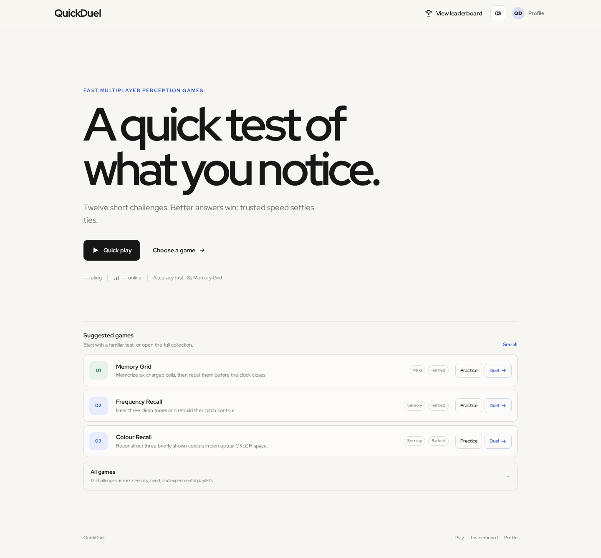

# QuickDuel

Accuracy first. Speed breaks ties.

QuickDuel is a production-minded multiplayer collection of twelve short browser
games. It has anonymous entry, optional Google account linking, public and
private duels, server-authoritative scoring/Elo, personal progression, weekly
competition, lightweight friends, and clearly labelled Practice Bots.

## Screenshots



Mobile, gameplay, and live-duel captures are in [`docs/screenshots`](docs/screenshots/).
Generated composition references live in `docs/design-references/`.

## Product features

- Anonymous Supabase Auth with upgrade-in-place Google linking
- Editable display name and profile accent
- Concurrency-safe rating-aware queue with Quick, Sensory, Mind, Experimental,
  and single-game preferences
- Explicit Practice Bot offer after eight seconds; never disguised or ranked
- Ten ranked games and two experimental unranked games
- Memory Grid answer window reduced from 12 seconds to 8 seconds
- Correctness/accuracy first; server-measured completion time breaks ties
- Deterministic versioned challenges, Zod validation, and game-specific bots
- Server-regenerated results, server-measured time, atomic idempotent Elo
- Private per-match realtime subscription with authoritative reload on reconnect
- Two-party rematch, next opponent, Web Share/clipboard fallback
- Shareable private single/best-of-3/best-of-5 duels
- Cursor-paginated match history and participant-only match detail
- Per-game statistics, Elo-backed divisions, and weekly UTC seasons
- Public-code friends, blocks, expiring invitations, and presence recency
- Opt-in result cards with generated Open Graph images
- Playable onboarding and explicit queue-broadening consent
- First-party analytics, rate limits, enforcement, audit, and admin tooling
- Gameplay-neutral owned/equipped cosmetics without payments or a shop
- Top-100 all-time leaderboard with current-player highlighting
- Responsive calm-light UI with progressive disclosure and reduced-motion support
- Structured loading, offline, expiry, configuration, and validation errors

## Stack

Next.js App Router, strict TypeScript, React, Tailwind CSS, Supabase Postgres/Auth/
Realtime, Web Audio, Zod, Vitest, npm, GitHub Actions, and Vercel serverless
routes. No custom WebSocket server, Redis, worker, or persistent Node server is
required.

## Architecture

The browser is a renderer and input source, not the ranked match authority.
Authenticated route handlers use a server-only modern Supabase secret to
regenerate deterministic challenges and calculate results. PostgreSQL owns queue
locking, private series, social transactions, trusted timing, statistics,
seasons, and Elo transactions. The secret never enters a browser bundle. See
[`docs/architecture.md`](docs/architecture.md).

## Local development

Requirements: Node.js 22+ and npm.

```bash
npm install
cp .env.example .env.local
npm run dev
```

The public home and unranked practice mode work without Supabase. Ranked play,
profiles, online activity, and leaderboard data require:

```env
NEXT_PUBLIC_SUPABASE_URL=
NEXT_PUBLIC_SUPABASE_PUBLISHABLE_KEY=
NEXT_PUBLIC_APP_URL=http://localhost:3000
SUPABASE_SECRET_KEY=
# Optional server-side error ingestion
OBSERVABILITY_DSN=
```

Follow [`docs/setup-supabase.md`](docs/setup-supabase.md) to enable anonymous
Auth, link the project, and run:

```bash
npx supabase db push
```

## Testing

```bash
npm run lint
npm run typecheck
npm run test
npm run build
npm run test:e2e
```

Connected database verification is documented in
[`docs/testing.md`](docs/testing.md) and `supabase/tests/verification.sql`.

## Deploy

Import the GitHub repository into Vercel, set the three public values plus the
server-only sensitive `SUPABASE_SECRET_KEY`, deploy, then configure Supabase
Auth URLs. Exact steps: [`docs/deploy-vercel.md`](docs/deploy-vercel.md).

## Security model

- A modern `sb_secret_` key is used only in Next.js route handlers and stored as
  a sensitive Vercel variable. It is never committed or exposed client-side.
- RLS is enabled on every public table.
- Direct queue, match, score, result, rating, and statistics writes are denied.
- Authenticated security-definer functions validate `auth.uid()`, participant
  membership, phase timing, cell bounds/uniqueness, and duplicate submission.
- Match finalization locks the match row and is idempotent.
- Browser anti-cheat is not perfect; the server blocks fabricated outcomes but
  users can record stimuli that must necessarily be displayed or played.

## Current limitations

- A live two-user/RLS/realtime test requires a user-owned Supabase project.
- Incomplete matches expire without a rating forfeit.
- Google OAuth needs a user-owned Google Client ID and Client Secret configured
  in Supabase before its button becomes operational.
- Analytics retention needs an owner-installed Supabase scheduled cleanup.
- Match invalidation does not automatically reverse historical Elo.
- Rate limits are account based; edge/IP throttling is a deployment concern.

Game, audio, scoring, and fairness references:
[`docs/games.md`](docs/games.md), [`docs/audio.md`](docs/audio.md),
[`docs/scoring.md`](docs/scoring.md), and
[`docs/fairness-limitations.md`](docs/fairness-limitations.md).

New product and operations references:
[`private duels`](docs/private-duels.md),
[`history/stats`](docs/match-history.md),
[`divisions/seasons`](docs/divisions-and-seasons.md),
[`friends`](docs/friends.md), [`analytics`](docs/analytics.md),
[`security`](docs/security.md), [`privacy`](docs/privacy.md), and
[`admin`](docs/admin.md).

## Ranked integrity and match chat

Ranked ruleset 2 is server-authoritative. After both players are ready, the
server assigns `starts_at`; once that official start is reached, the match is
committed. The answer deadline is the start plus reveal and answer durations,
followed by one database-owned five-second grace period. One valid submission
versus one missing submission becomes a timeout forfeit with atomic Elo. Two
missing submissions become a double timeout with no Elo or season points.
Presence and browser timers are never proof of abandonment.

Anonymous ratings remain visible to their owner but provisional. Permanent and
weekly public leaderboards require a linked identity, five ranked human matches,
and a normal account state. High-risk routes add short-lived HMAC network
buckets and adaptive Turnstile verification.

Live chat is limited to the two match participants. Blocking disables access,
sends are rate limited, messages can be reported, and messages expire after
seven days. There is no global chat or inbox.

## Dependency updates

Direct dependencies are pinned to exact lockfile versions and Node 22 is the
supported production runtime. Dependabot opens grouped monthly npm and Actions
PRs; security alerts may open sooner and are never auto-merged. Review upstream
changelogs, run lint/typecheck/unit/E2E/build, perform browser smoke tests, and
merge upgrades intentionally.
